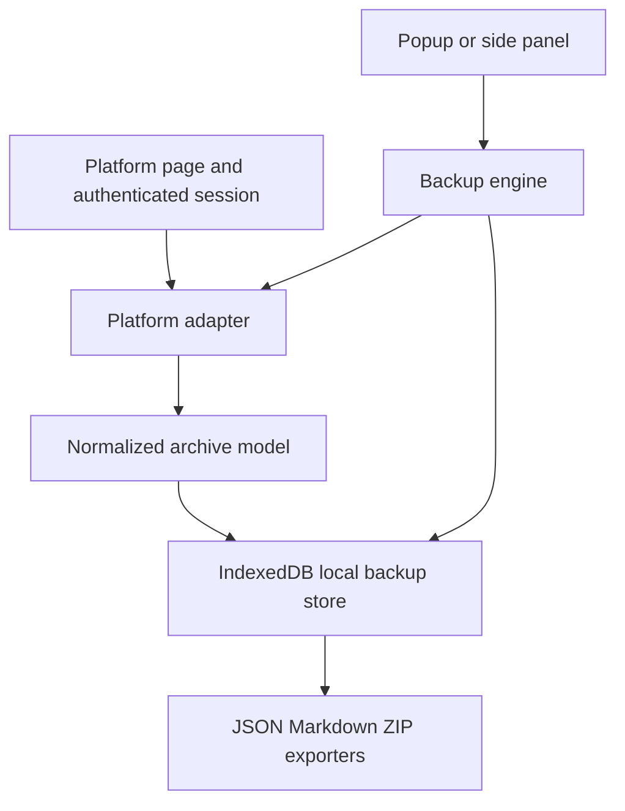

# Architecture

Universal Chat Backup has five layers.

The platform adapter owns detection, transport, response parsing, pagination, and platform quirks. Core code receives normalized records and never branches on platform for extraction behavior.

The backup engine discovers references, retrieves conversations with bounded concurrency, validates and deduplicates normalized data, writes transactionally to IndexedDB, and reports item-level progress and errors. An interrupted job must leave the last committed backup valid.

The service worker coordinates jobs and messages. The UI displays state and requests operations. If a platform requires page-context access, a small audited bridge runs only for that adapter and accepts validated message schemas. It never receives or persists credentials.

IndexedDB stores archive records, synchronization state, and sanitized error records. Extension settings may use `chrome.storage.local`, but chat content does not.

Exporters read normalized records only. Canonical JSON is lossless within the schema. Markdown is human-readable. ZIP output uses deterministic, safe names and includes a manifest.

## Browser contexts

- The popup or side panel provides controls and status.
- The service worker coordinates durable operations and messaging.
- Content scripts access the supported platform page in an isolated world.
- A page bridge is optional and narrowly scoped when the platform exposes needed state only in the page world.

## Security boundary

All page responses are untrusted. Validate before normalization. Do not export or log cookies, authorization headers, tokens, or message bodies in diagnostics. Do not use arbitrary evaluation or remote scripts.

